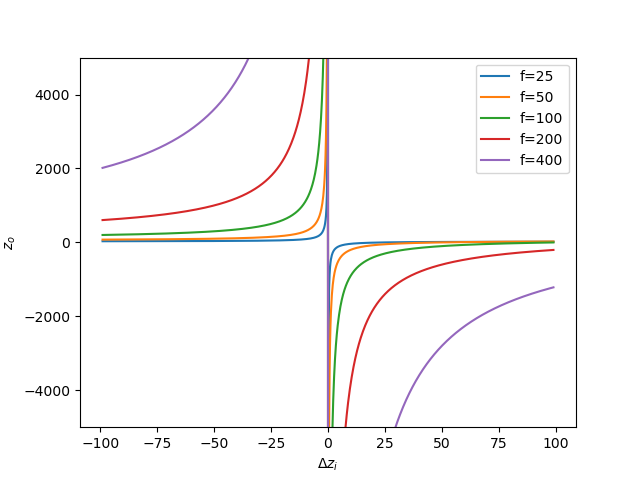
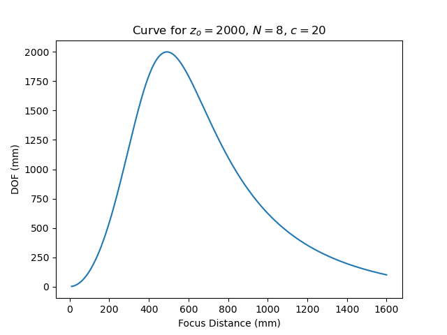
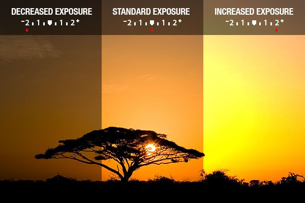
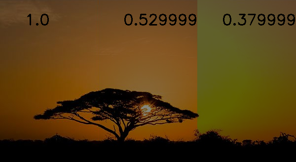
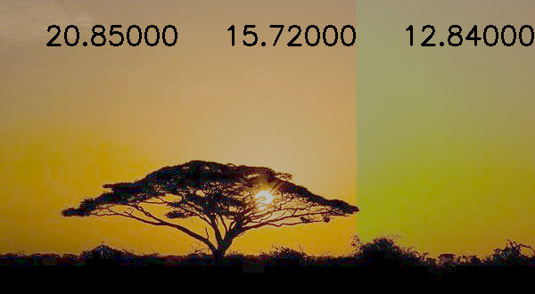
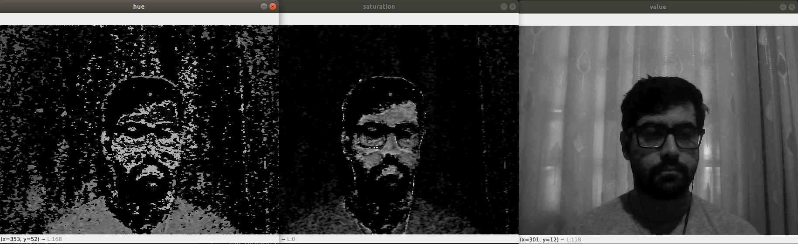
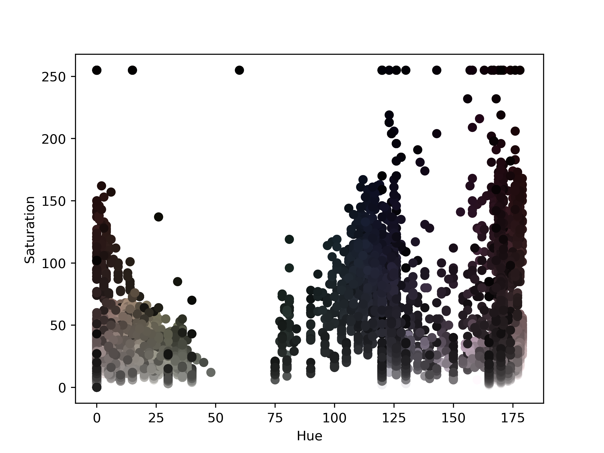
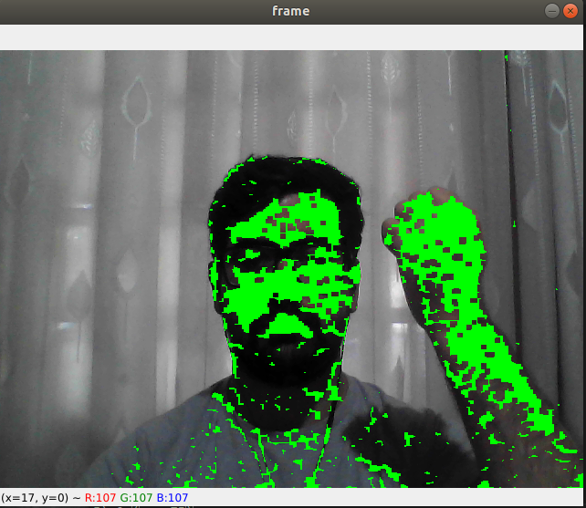

# Chapter 2: Image formation

## Question 2-1: Least squares intersection point and line fitting — advanced

For this question I made a pdf using LaTeX, since I did not find a good way to display equations in github.

I also left the item 3 blank since I did not find any concise and beautiful interpretation, despite the geometric intuition.

## Question 2-2: 2D transform editor

Upon launching the code, you will find an empty canvas like this:

The controls goes as follows:
* Click on the rectangle to add a new rectangle.
  * Click on the start and end position of the rectangle.
* Choose the transformation on the top, each transformation will display different buttons (according to the degrees of freedom of the transform).
* After choosing a button for the transform, simply move the mouse around, and when you're satisfied just click again.
* Press the esc button to exit.

One example of usage can be seen bellow.

Note that, the rectangles are transformed by transforming their vertices and linking them again, since doing a naive for loop at each pixel would be extremely slow.

The save button was not used for saving, instead I tried to do something different and used it to put an image over the rectangle. But by doing this, we cannot continue with the approach of transforming only the corners, we must make a point-wise transformation, this is why the program gets extremely slow.

One example from such usage can be seen here:

Some comments about this question:

* The code is extremely slow and inefficient, ard there is a lot of room for improvement.
* We can clearly see by the Lena image that interpolation was not performed, so we have these white spots.
* I started coding without having a clear idea about how to do it, and I ended up with spaghetti code. I'll try to change this behavior in future questions.

## Question 2-3: 3D viewer

In this question, I start with an initial camera center, the camera optical axis and the camera's field of view (fov). Then the use can control the displayed image by using the buttons WASD, as in common fps games. The only difference is that the A and D buttons actually rotate the camera, instead of translating like usual games.

The image generation was not feasible for real time interaction, it would take 16s to generate a single frame, to overcome this, I used [numba](http://numba.pydata.org/) in order to speed-up my implementation.

## Question 2-4: Focus distance and depth of field

The code for the plots is inside question2-4.py, and the formula deduction is in question2-4.pdf. For the first item we obtain the following progression of the focus distances:

For the second item, we find the formula for the Depth of Field, and use it to compute the plot for the third item, which gives the DOF as we zoom in.

## Question 2-7: Gamma correction in image stitching

In this question, I got an image from Google Images that represented a scene with different exposures, the image I got was this one:

I then tried to correct it by linearly adjusting the values, since one would guess that the camera receiving brightness changes linearly with the exposure. I just didn't know if I should do that after doing the gamma correction or not. I tried firstly without the gamma correction and I obtained the following:

Which managed to stich the first two parts, but not the last one. I then again tried with the gamma correction:

And again the same problem! I conjectured that there was another modification in the last image, such that simply linearly trying to adjust won't make it. Note that the numbers in each image is the factor by which the values were multiplied.

## Question 2-8: Skin color detection

For this question I decided to work on HSV color space, since there I could probably find a better way to threshold the image for the skin color. In order to find the good values to threshold, I first took a look at each channel for a single frame:

We can clearly see that the value channel won't help us much, so we make a 2D scatterplot using the Hue and Saturation values.

Now we can see that the values corresponding to my skin tone are located in low and high Hue values, and small saturation values. By applying a chosen threshold and doing some morphological operations on the mask in order to reduce noise, and we obtain:

Where I changed the "skin pixels" to green (0, 255, 0).
