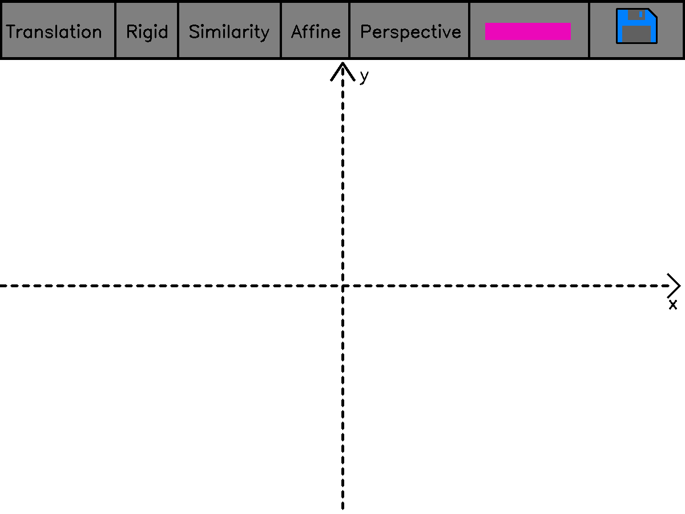
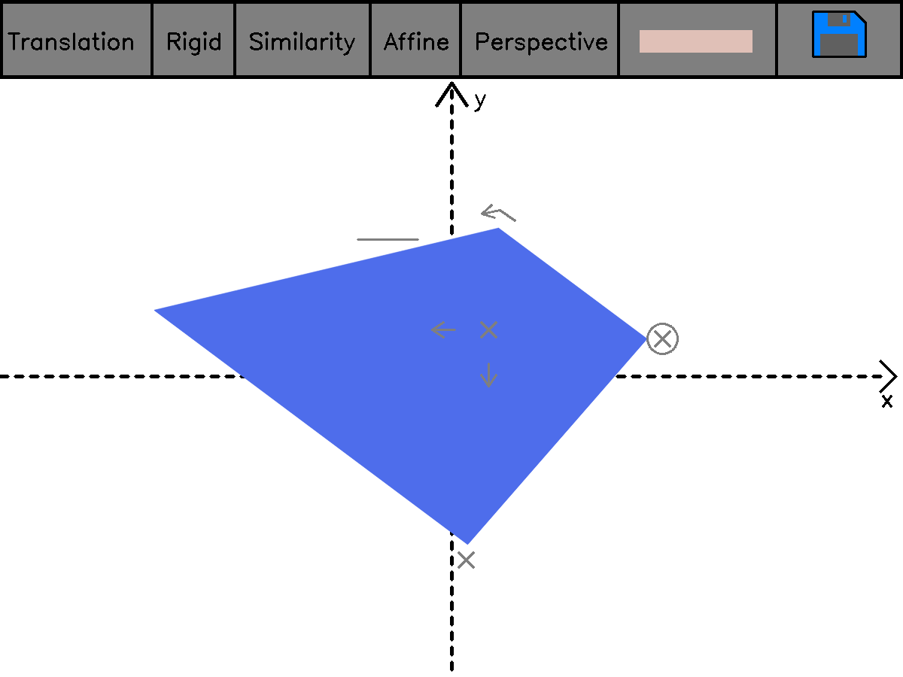
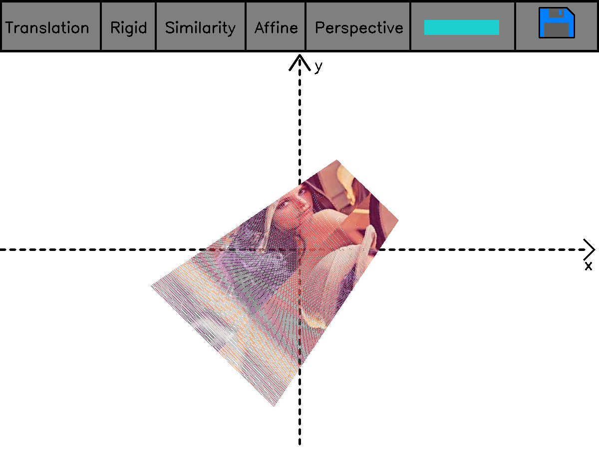

# Chapter 2: Image formation

## Question 2-1: Least squares intersection point and line fitting — advanced

For this question I made the equations using latex, which is displayed correctly in VS Code, but unfortunately does not display in github. I will try to correct this behavior in the future.

I also left the item 3 blank since I did not find any concise and beautiful interpretation, despite the geometric intuition.

## Question 2-2: 2D transform editor

Upon launching the code, you will find an empty canvas like this:

The controls goes as follows:
* Click on the rectangle to add a new rectangle.
  * Click on the start and end position of the rectangle.
* Choose the transformation on the top, each transformation will display different buttons (according to the degrees of freedom of the transform).
* After choosing a button for the transform, simply move the mouse around, and when you're satisfied just click again.
* Press the esc button to exit.

One example of usage can be seen bellow.

Note that, the rectangles are transformed by transforming their vertices and linking them again, since doing a naive for loop at each pixel would be extremely slow.

The save button was not used for saving, instead I tried to do something different and used it to put an image over the rectangle. But by doing this, we cannot continue with the approach of transforming only the corners, we must make a point-wise transformation, this is why the program gets extremely slow.

One example from such usage can be seen here:

Some comments about this question:

* The code is extremely slow and inefficient, ard there is a lot of room for improvement.
* We can clearly see by the Lena image that interpolation was not performed, so we have these white spots.
* I started coding without having a clear idea about how to do it, and I ended up with spaghetti code. I'll try to change this behavior in future questions.

## Question 2-3: 3D viewer

In this question, I start with an initial camera center, the camera optical axis and the camera's field of view (fov). Then the use can control the displayed image by using the buttons WASD, as in common fps games. The only difference is that the A and D buttons actually rotate the camera, instead of translating like usual games.

The image generation was not feasible for real time interaction, it would take 16s to generate a single frame, to overcome this, I used [numba](http://numba.pydata.org/) in order to speed-up my implementation.

