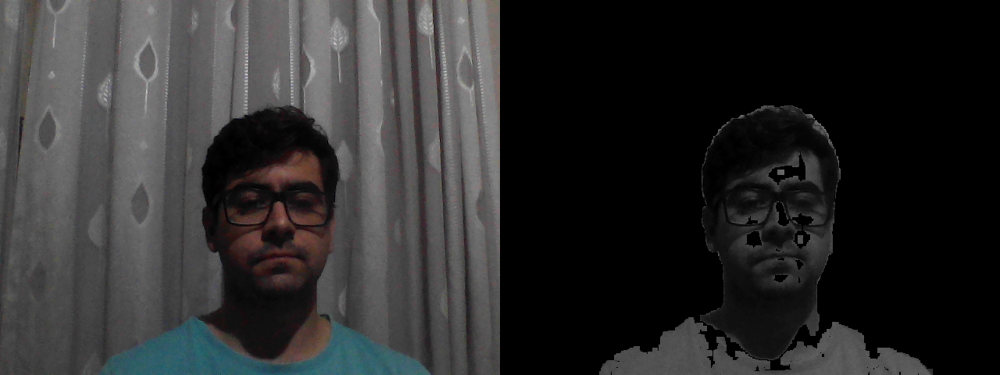
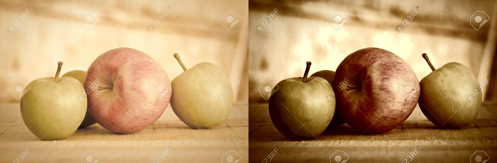
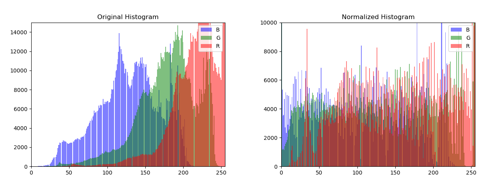
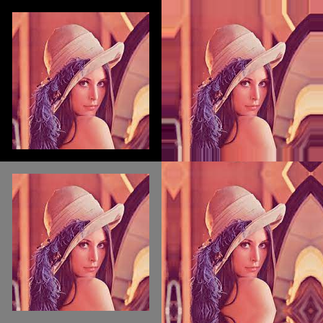
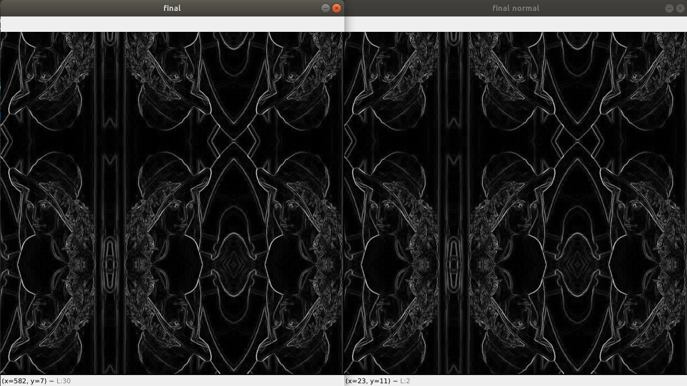

# Chapter 3: Image Processing

## Question 3-1: Color balance

I made a simple application with the sliders to change the color balance, it simply multiplies by a factor between 0 and 1. 

To answer the questions:
1. It wouldn't change, since multiplying and taking an exponent of the factor, has the same value of multiplying by another number.
2. I can't perform this experiment.
3. If the foreground and background were taking with different color balances, we would have to twist one of them.

## Question 3-5: Difference keying

I analysed 10 frames to extract the mean and the standard deviation from the background, and also used some morphological post processing in order to reduce the noise in the image. I thresholded at 1.75 standard deviations from the background, and this was the result:

## Question 3-7: Histogram Equalization

For this question I converted the image do the YCrCb domain, since it's made for digital images, I equalize the Y channel (luminance) and I made the "punch" the author suggested, clipping the 5% lower/higher pixels to 0/255. I did not code the implementation of the algorithm, but rather used OpenCV function.

The test image before and after normalization, and their corresponding histograms are:

## Question 3-9: Padding for neighborhood operations

In this question I implemented "zero", "constant", "clamp" and "mirror" paddings. All of those applied can be seen in the image below:

## Question 3-10: Separable filters

I implemented the separable convolution, and added an option to approximate any kernel within some orders of magnitude from the SVD. For the record I made a test using the separable convolution and normal convolution in a kernel of size 121 x 121. The time for separable was 6.13s and the time for normal convolution was 12.21s. Remember that this is a Python unoptimized code. 

Picture of a test using Sobel Filters:

