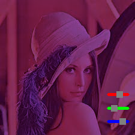

# Chapter 3: Image Processing

## Question 3-1: Color balance

I made a simple application with the sliders to change the color balance, it simply multiplies by a factor between 0 and 1. 

## Question 3-2:
